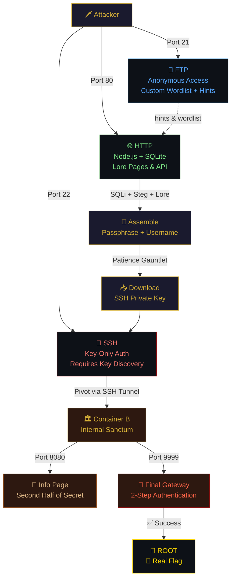

<div align="center">

<!-- ═══════════════════════════════════════════════════════════════ -->
<!-- ANIMATED HEADER -->
<!-- ═══════════════════════════════════════════════════════════════ -->


<br/>

<!-- ═══════════════════════════════════════════════════════════════ -->
<!-- TYPING ANIMATION -->
<!-- ═══════════════════════════════════════════════════════════════ -->

<a href="https://git.io/typing-svg">
  
</a>

<br/>

<!-- ═══════════════════════════════════════════════════════════════ -->
<!-- BADGES ROW 1 — STATUS -->
<!-- ═══════════════════════════════════════════════════════════════ -->


<br/><br/>

<!-- ═══════════════════════════════════════════════════════════════ -->
<!-- BADGES ROW 2 — TECH -->
<!-- ═══════════════════════════════════════════════════════════════ -->


<br/>

<!-- ═══════════════════════════════════════════════════════════════ -->
<!-- DIVIDER -->
<!-- ═══════════════════════════════════════════════════════════════ -->


</div>

<br/>

## 𓁹 The Lore

> *Deep beneath the digital sands lies the tomb of the **Seventh Scribe**, guarded by an ancient, automated defense mechanism known as **The Anubis Protocol**. A previous excavation team disappeared, leaving behind only scattered notes, locked archives, and a warning that the scales of judgment are unforgiving.*

> *To breach the Inner Sanctum, you must embrace the mindset of a **cyber-archaeologist**. Read the lore, follow the breadcrumbs, and prove your conviction. The tomb demands human intuition, patience, and a sharp eye.*

<br/>

<div align="center">

<!-- ═══════════════════════════════════════════════════════════════ -->
<!-- CHALLENGE INFO TABLE -->
<!-- ═══════════════════════════════════════════════════════════════ -->

<table>
<tr><td align="center" width="150"><b>𓃭 Property</b></td><td align="center" width="350"><b>𓁿 Details</b></td></tr>
<tr><td align="center"><code>Difficulty</code></td><td align="center">🔴 <b>Hard</b></td></tr>
<tr><td align="center"><code>Ports</code></td><td align="center"><code>21</code> (FTP) · <code>22</code> (SSH) · <code>80</code> (HTTP)</td></tr>
<tr><td align="center"><code>Flags</code></td><td align="center">1 Real + 2 Decoy Traps</td></tr>
<tr><td align="center"><code>Flag Format</code></td><td align="center"><code>necrosand{...}</code></td></tr>
<tr><td align="center"><code>Containers</code></td><td align="center">2 — Gateway + Internal Sanctum</td></tr>
<tr><td align="center"><code>Solve Time</code></td><td align="center">~1 to 3 hours</td></tr>
<tr><td align="center"><code>Event</code></td><td align="center"><b>NecroSand CTF</b></td></tr>
</table>

</div>

<br/>

## 𓂝 Skills Required

<div align="center">

```
 ╔══════════════════════════════════════════════════════════════╗
 ║                                                              ║
 ║   🔍 Enumeration          ·  Web & Network Reconnaissance    ║
 ║   💉 SQL Injection        ·  Database Extraction             ║
 ║   🖼️ Steganography        ·  Hidden Data in Images           ║
 ║   🌐 Network Pivoting     ·  SSH Tunneling & Port Forwarding ║
 ║   🧩 Lore-Based Puzzles   ·  Contextual Reasoning            ║
 ║   🔐 Cryptographic Clues  ·  Pattern Recognition             ║
 ║                                                              ║
 ╚══════════════════════════════════════════════════════════════╝
```

</div>

<br/>

<div align="center">

</div>

<br/>

## 𓊝 Architecture

```
                          ┌──────────────────────┐
                          │   🗡️ ATTACKER MACHINE  │
                          └──────────┬───────────┘
                                     │
                    ╔════════════════╧════════════════╗
                    ║        EXPOSED  PORTS           ║
                    ║   21 (FTP) · 22 (SSH) · 80 (HTTP) ║
                    ╚════════════════╤════════════════╝
                                     │
                 ┌───────────────────┴───────────────────┐
                 │                                       │
                 │   📡  CONTAINER A — THE GATEWAY       │
                 │   ─────────────────────────────────   │
                 │   🌐 Node.js Web Server (Port 80)     │
                 │   📁 FTP Server — Anonymous Access     │
                 │   🔑 SSH Server — Key-Only Auth        │
                 │   📍 IP: 172.19.0.2                    │
                 │   🔗 Networks: external + internal     │
                 │                                       │
                 └───────────────────┬───────────────────┘
                                     │
                           internal_sanctum
                            172.19.0.0/24
                          (isolated network)
                                     │
                 ┌───────────────────┴───────────────────┐
                 │                                       │
                 │   🏛️  CONTAINER B — INNER SANCTUM     │
                 │   ─────────────────────────────────   │
                 │   ⚠️  NOT reachable from outside       │
                 │   📜 Info Page (Port 8080)              │
                 │   🚪 Final Gateway (Port 9999)         │
                 │   👑 SUID Binary + root.txt            │
                 │   📍 IP: 172.19.0.13                   │
                 │                                       │
                 └───────────────────────────────────────┘
```

> [!IMPORTANT]
> **Container B is completely isolated.** It exists on an internal-only Docker network. You **cannot** access it directly from your attacker machine — you **must** pivot through Container A.

<br/>

<div align="center">

</div>

<br/>

## 𓇳 Attack Surface Overview

<div align="center">



</div>

<br/>

## 🛡️ Anti-Automation & Anti-AI Design

> [!WARNING]
> This machine was specifically engineered to **defeat automated solvers** and **AI agents** while remaining fair and engaging for human players.

<div align="center">

| 🔒 Protection | 🛡️ How It Works |
|:---:|:---|
| **No `robots.txt`** | Zero free path disclosure |
| **Custom Wordlist Required** | Standard wordlists won't find Egyptian-themed pages |
| **Image-Based Secrets** | Critical data embedded in PNG — invisible to `curl` |
| **Steganography** | Hidden word inside JPEG with visual-only password |
| **Riddle-Based Flags** | SQLi returns a riddle, not the answer |
| **Decoy Database Rows** | Fake entries pollute automated dumps |
| **Patience Gauntlet** | Randomized 3-5 submissions with cooldown timer |
| **One-Time Download Token** | SSH key download expires in 90 seconds |
| **Split Secrets** | Secret Name fragmented across two containers |
| **2-Step TCP Auth** | Port 9999 requires two sequential interactive inputs |
| **Fake Flag Traps** | Two convincing decoy flags on Container A |
| **Restricted Shell** | No `wget`, `python`, `nc`, `perl` on Gateway |

</div>

<br/>

<div align="center">

</div>

<br/>

## 🚀 Deployment

### Option 1 — OVA Import *(Recommended)*

> The easiest way to deploy. Import the pre-built appliance into VirtualBox.

```
📦 AnubisProtocol.ova (~1 GB)
```

**Step 1** — Import into VirtualBox:
```
File → Import Appliance → Select AnubisProtocol.ova → Import
```

**Step 2** — Configure Network:
| Use Case | Adapter Type |
|:---|:---|
| Local CTF / LAN | Bridged Adapter |
| Isolated Lab | Host-Only Adapter |

**Step 3** — Start the VM. The IP address will appear on the console:

```
 ====================================
   THE ANUBIS PROTOCOL - CTF
 ====================================
   IP: 192.168.x.x
   Ports: 22(SSH) 80(HTTP) 21(FTP)
 ====================================
```

**Step 4** — Start attacking:
```bash
nmap -sC -sV <TARGET_IP>
```

<br/>

### Option 2 — Docker Compose *(For Development / Rebuilding)*

> [!NOTE]
> Requires **Docker** & **Docker Compose** installed. Ports `21`, `22`, and `80` must be available.

```bash
# Clone and navigate to the project
cd AnubisProtocol

# Build and start (first build takes 3-5 minutes)
docker-compose up --build -d

# Verify containers are running
docker-compose ps
```

You should see:
```
NAME              STATUS
anubis_gateway    Up
anubis_sanctum    Up
```

```bash
# Stop the machine
docker-compose down

# Full restart (clean slate)
docker-compose down -v && docker-compose up --build -d
```

<br/>

<div align="center">

### ⚙️ Requirements

| | OVA Deployment | Docker Deployment |
|:---|:---:|:---:|
| **Platform** | VirtualBox 7.x+ | Docker + Docker Compose |
| **RAM** | 1 GB minimum | 2 GB minimum |
| **Disk** | 8 GB | ~2 GB |
| **Network** | Adapter configured | Ports 21, 22, 80 free |
| **Internet** | ❌ Not needed | ✅ First build only |

</div>

<br/>

<div align="center">

</div>

<br/>


<!-- ═══════════════════════════════════════════════════════════════ -->
<!-- DOWNLOAD SECTION -->
<!-- ═══════════════════════════════════════════════════════════════ -->

<div align="center">

## 📥 Download

<a href="https://www.mediafire.com/file/ra80t4n95t8cd83/AnubisProtocol.zip/file">
  
</a>

<br/><br/>

<code>📦 AnubisProtocol.ova — ~1 GB</code>

</div>

<br/>

<div align="center">

</div>

<br/>

<!-- ═══════════════════════════════════════════════════════════════ -->
<!-- AUTHOR SECTION -->
<!-- ═══════════════════════════════════════════════════════════════ -->

<div align="center">

## 𓁢 Created By

<a href="https://github.com/anasofficialnet">
  
</a>

<br/><br/>

### **Anas Abdul Aziz**

`Pentester` · `Tool Developer` · `Web Application Security`

<br/>

<a href="https://github.com/anasofficialnet">
  
</a>

<br/><br/>

<a href="https://github.com/anasofficialnet?tab=repositories">
  
</a>

</div>

<br/>

<!-- ═══════════════════════════════════════════════════════════════ -->
<!-- FOOTER -->
<!-- ═══════════════════════════════════════════════════════════════ -->

<div align="center">


<br/>

```
Built for educational CTF purposes only.
Created for the NecroSand Event.
```

<sub>𓃭 <i>"The scales of Ma'at weigh the hearts of all who enter."</i> 𓃭</sub>

</div>
